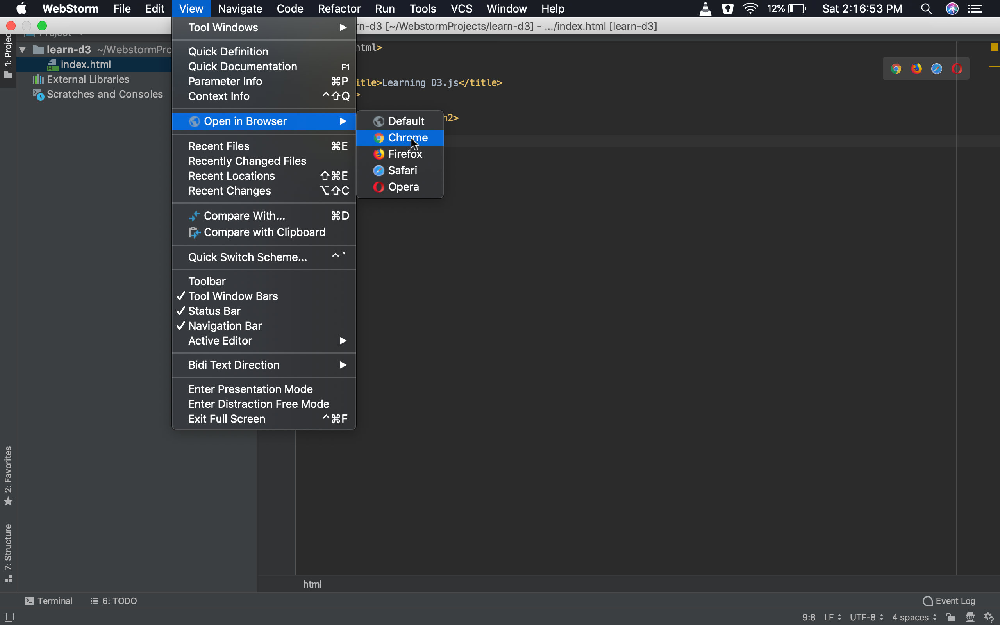
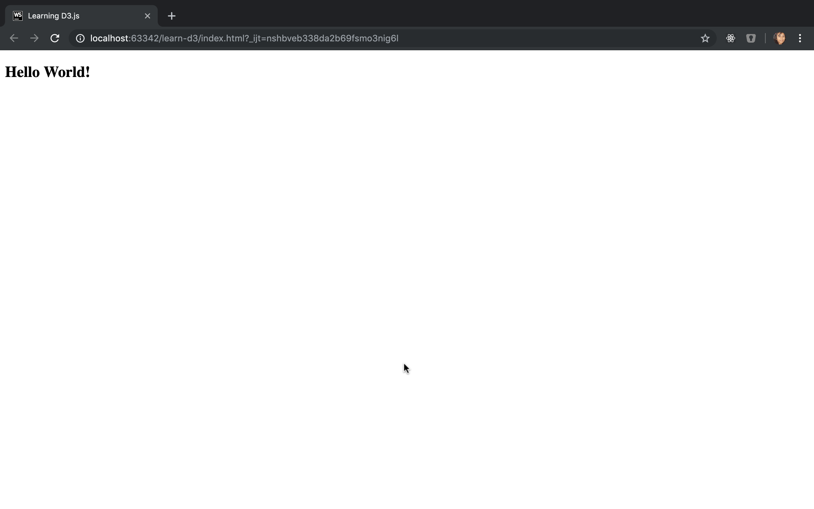
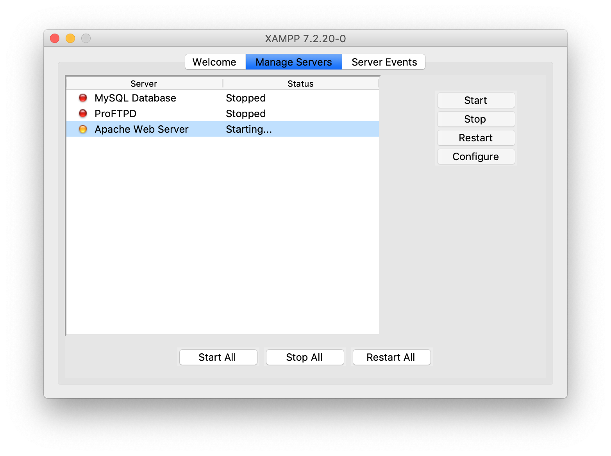
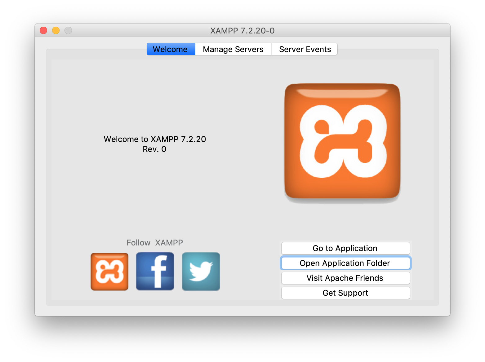
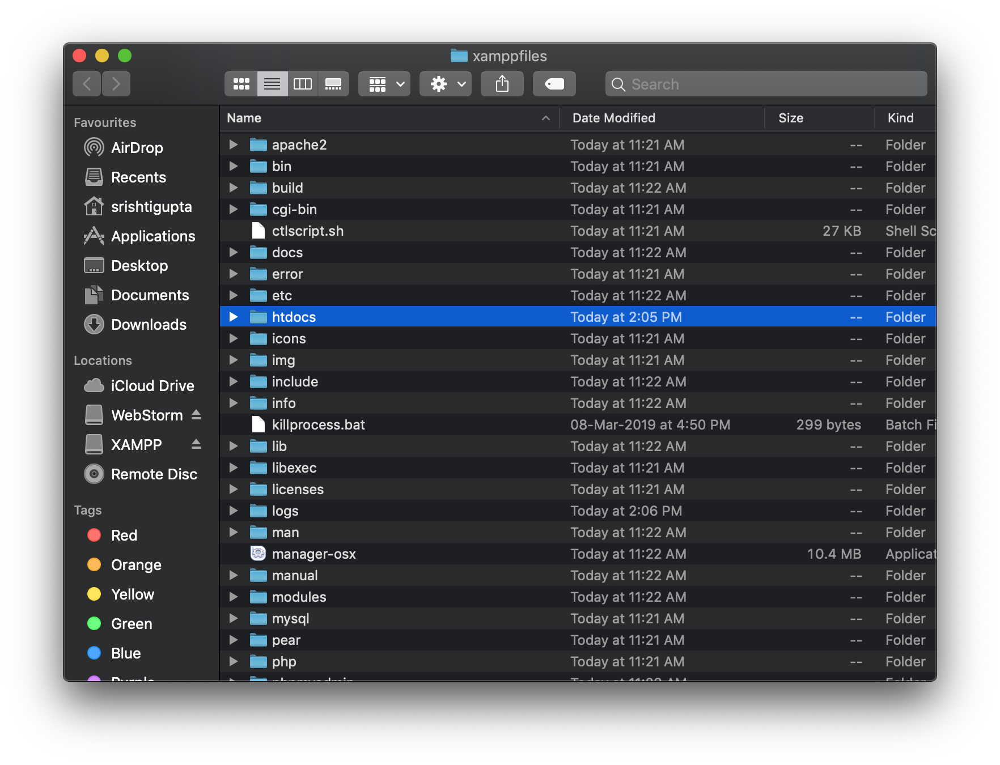
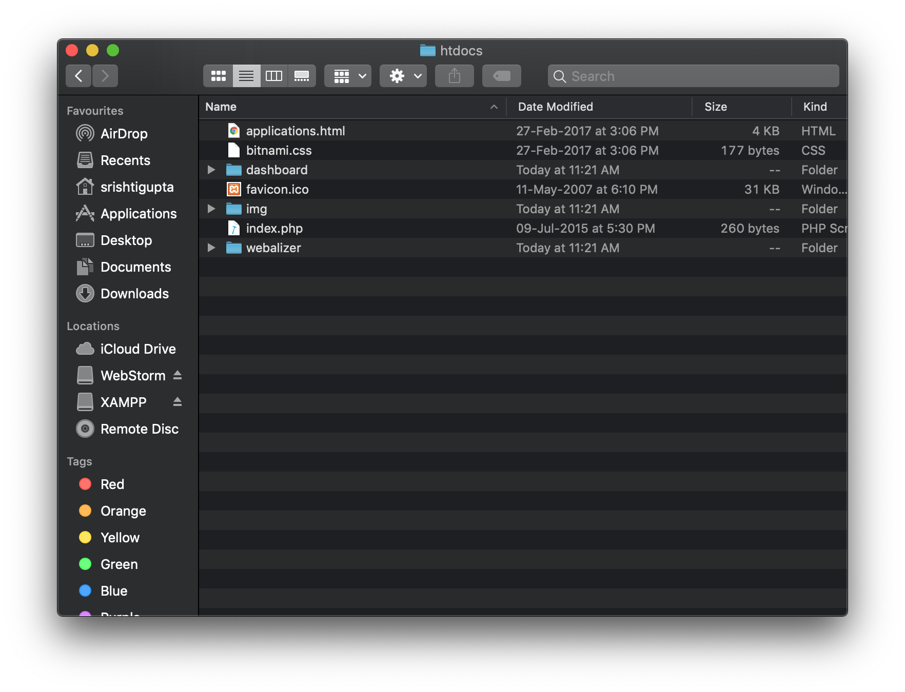
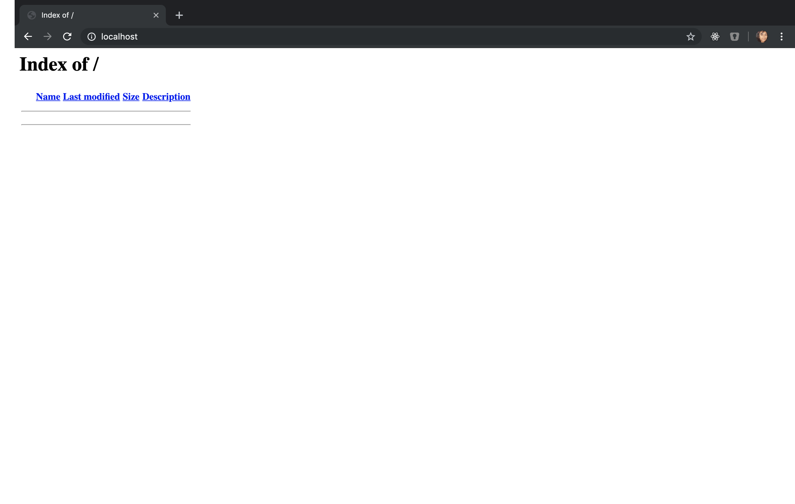

# Learn and Understand D3.js for Data Visualization

## Table of Contents
[01 - Introduction](#01---introduction)  

## 01 - Introduction

For HTML, opening up a file directly by double-clicking on it is just fine but when you need to load data from external sources, the browsers will not allow you to do this due to security reasons. The browsers, in such a case, want you to be on a server. So the question is - How do you get a server? Let's explore some options to get a local server running locally on your machine.

### WebStorm

[**WebStorm**](https://www.jetbrains.com/webstorm/download) by JetBrains is an IDE that provides you with the local server configuration out-of-the-box. You don't have to do anything for setting up the server. Just download WebStorm and get going.

Create a new HTML file in WebStorm project named `index.html` and paste the following code in it:

```html
<!DOCTYPE html>
<html>
    <head>
        <title>Learning D3.js</title>
    </head>
    <body>
        <h2>Hello World!</h2>
    </body>
</html>
```

Now, follow the steps given below to view the output on a local web server:
1. On the `index.html` file, Click on 'View' menu
2. Select 'Open in Browser' menu-item
3. Click on browser of your choice

The above steps can be visualized in the screenshot given below:



These steps will open your HTML file in a new browser tab/window. If you see the URL of the webpage opened, you can find that the webpage is running on `localhost`, which indicates that the file is coming from the local server set up in your computer and not from an external server. The file with HTML code given above, when run on local server, will produce the output as given in the screenshot given below:




Sometimes, you will not be able to see the 'Open in Browser' option in the 'View' menu in WebStorm. This indicates that the file is not of HTML type. This menu option is visible for only HTML files.

### XAMPP

Because WebStorm is premium, you can find an alternative to setting up your local development server using [XAMPP](https://www.apachefriends.org/download.html) (Cross-Platform Apache MariaDB PHP Perl). It allows you to create a development server on your local machine for free. 

After installing XAMPP, follow the steps mentioned below based on your operating system:

> **Windows:**
1. Open 'XAMPP Control Panel'
2. Click on 'Start' button corresponding to 'Apache'

> **macOS:**
1. Open 'manager-osx'
2. Click on 'Manage Servers' tab
3. Select 'Apache Web Server' and click on 'Start' button on the right side

The above steps can be visualized in the screenshot given below:



This will turn the color of Apache to green indicating that the Apache web server is now running on your local machine, as shown in the screenshot given below:


Now, visit the following URL in your browser:  
[http:\\\localhost](http://localhost)

You will see a webpage consisting of a welcome message. You can configure your XAMPP in such a way that it does not show you the welcome message when you start your local server but instead shows you the list of the files and folders corresponding to all your projects/applications.

> **Windows:**
1. Click on 'Explorer' button in 'XAMPP Control Panel' 

> **macOS:**
1. Go to 'Welcome' tab in 'manager-osx'
2. Click on 'Open Application Folder' button

The above steps can be visualized in the screenshot given below:



This will open the File Explorer (in Windows) or Finder (in macOS) on your machine where you can see a lot of files and folders. The folder, which you need to concentrate on, is the `htdocs` folder, which is short for HyperText Documents. Take a reference from the screenshot given below:



When you go inside this folder, you will see a couple of files and sub-folders, as shown in the screenshot given below:



You can safely delete all what you see inside `htdocs` folder and later, you can add new projects/applications folders inside it.

Now, when you refresh your webpage with the URL [http:\\\localhost](http://localhost), you will find that the webpage now shows the index page, as shown in the screenshot given below:



### D3.js and Web Server

D3.js is a client-side library and you do not need a server for a client-side library. However, you still need a server for D3 because you'll be requesting data from external servers and the browsers will not allow you to do this in a simple file-based mechanism. It will only render information from external servers when it sees that you are also on a server. Thus, this is the reason why you've configured a server for D3.js.

### What is Data Visualization?

Data Visualization is the ability to convey a story or idea as efficiently as possible because a picture is worth more than a thousand words. It makes the end-user comprehend data more conveniently. It also helps the users to explore patterns in the data. 

The three building blocks of data visualization are - **shapes**, **color**, and **size**.

Following things are important to know in order to make a good visualization of data:
- **Define Context**
    - Who is the audience?
    - What do they need to do?
    - What do they need to do with the data?
- **Choose Appropriate Visualization**
    - You can choose an appropriate visualization only after knowing the data and the audience. ([Read this blogpost!](http://www.vizwiz.com/2013/01/alberto-cairo-three-steps-to-become.html))
- **Remove Clutter**
    - Raw data may consist of unnecessary information. Take a call on whether certain information should be displayed visually.
- **Draw Attention using Building Blocks of Data Visualization - Shape, Size, and Color**
    - Highlight the important parts using appropriate shapes, sizes and colors.
- **Tell a Story**
    - Some of the greatest data visuals tell a story which resonates both intellectually and emotionally with the audience. ([Read this post!](https://www.thinkwithgoogle.com/marketing-resources/data-measurement/tell-meaningful-stories-with-data/)) Remember that the data alone is 'powerful' but with a good story it is 'unforgettable'. 

### What exactly is D3.js?

D3 stands for Data-Driven Documents. It helps to close the gap between data and visualization on the web. It can help you to calculate size, shape, color, and position for your data. D3 assists you by providing you with a set of functions to display data on a document, which is the web page. 

Data Visualization with D3 has two parts:

Data | Document
---------|----------
 The format of data can be JSON, CSV, plain text, etc. | The document is in the form of an HTML web page.
 The data should drive the visualization and not the other way around. | The document represents the data. The visual will depend on the data itself and not dictate what the data should be.

Example of Good Data Visualization:
https://pudding.cool/2017/05/song-repetition

----------------
